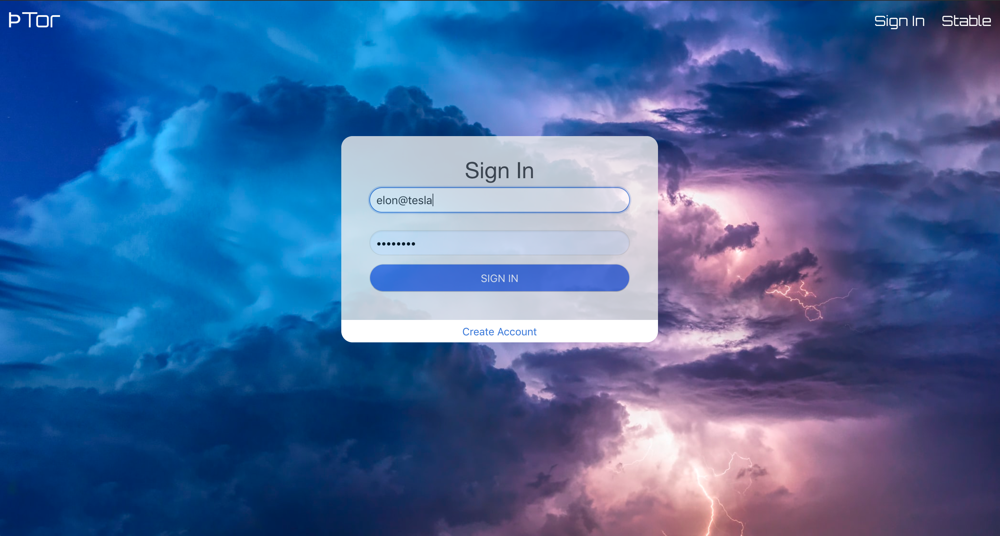

#  Software Engineering Immersive Project #4: Tor

Project 4 by:  Cliff Conolly

## Introduction

Tor is an app that use Python and Flask for the backend and an internal API. It is modeled after Wikipedia in that it is a database which lists current and future all electric and hybrid electric vehicles. It allows users to view the vehicles only, but only 'registered' users can add vehicles to the database.

Timeframe:
1 week (June 2019)

## Technologies used:
* React
* Python
* Flask
* PostgreSQL

## Overview:

###### Homepage

The homepage allows users to sign in if they would like to add a new vehicle to the database or non-registered users to just be able to view the collection of vehicles (see below) via the 'Stable' button.

###### Stable

###### Sign In

Non-registered users are able to register (see below) via the 'Sign In' form by clicking the 'Create Account' button.

###### Register

Once registered users are able to create a vehicle by clicking the 'Forge' button (see below).

###### Forge

## Wins

Setting up the backend with Python and Flask was a little tricky given that we had about 4 days getting familiar with them. Therefore getting them to work without breaking at the onset was very rewarding, and I could then concentrate on the frontend.

## Future features

- Going forward I will continue to work on the app and allow it to be able to consume data from an external API to get charging points throughout London.

### Live site: https://tor-electric.herokuapp.com/cars
